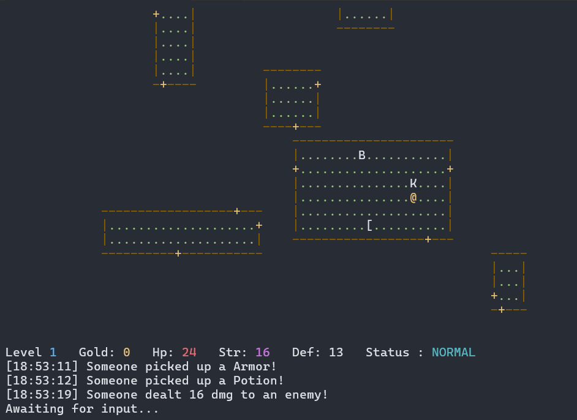

# RogueCPP

```text
                                                          
     ##### /##                                            
  ######  / ##                                            
 /#   /  /  ##                                            
/    /  /   ##                                            
    /  /    /                                             
   ## ##   /       /###     /###    ##   ####      /##    
   ## ##  /       / ###  / /  ###  / ##    ###  / / ###   
   ## ###/       /   ###/ /    ###/  ##     ###/ /   ###  
   ## ##  ###   ##    ## ##     ##   ##      ## ##    ### 
   ## ##    ##  ##    ## ##     ##   ##      ## ########  
   #  ##    ##  ##    ## ##     ##   ##      ## #######   
      /     ##  ##    ## ##     ##   ##      ## ##        
  /##/      ### ##    ## ##     ##   ##      /# ####    / 
 /  ####    ##   ######   ########    ######/ ## ######/  
/    ##     #     ####      ### ###    #####   ## #####   
#                                ###                      
 ##                        ####   ###                     
                         /######  /#                      
                        /     ###/                        
                                                          
      # ###       ##### ##         ##### ##               
    /  /###  / ######  /###     ######  /###              
   /  /  ###/ /#   /  /  ###   /#   /  /  ###             
  /  ##   ## /    /  /    ### /    /  /    ###            
 /  ###          /  /      ##     /  /      ##            
##   ##         ## ##      ##    ## ##      ##            
##   ##         ## ##      ##    ## ##      ##            
##   ##       /### ##      /   /### ##      /             
##   ##      / ### ##     /   / ### ##     /              
##   ##         ## ######/       ## ######/               
 ##  ##         ## ######        ## ######                
  ## #      /   ## ##            ## ##                    
   ###     /    ## ##            ## ##                    
    ######/     ## ##            ## ##                    
      ###  ##   ## ##       ##   ## ##                    
          ###   #  /       ###   #  /                     
           ###    /         ###    /                      
            #####/           #####/                       
              ###              ###                        
```

RogueCPP is a simple console-based roguelike game written in C++20. It features procedural map generation, basic enemy AI, and a text-based logging system.

## Screenshots



## Features

- Procedural Generation: Generates random rooms connected by corridors.
- Simple AI: Enemies move or follow the player using basic strategies.
- Event Logging: A log system displays events like attacks or item pickups in real time.
- Standard Roguelike Elements: Items (potions, weapons, armor) and basic stat tracking (HP, attack, defense).

## Project Structure and Design Patterns

The project uses standard design patterns to structure the code:
- Strategy Pattern: Used to manage enemy behaviors (wandering, chasing, escaping).
- Observer Pattern: Used to decouple the gameplay events from the console logger.
- Singleton Pattern: The event publisher is implemented as a singleton to allow global access.

## Controls (AZERTY Layout)

The game is configured for AZERTY keyboards:
- z: Move Up
- s: Move Down
- q: Move Left
- d: Move Right

## Map Legend

- @: Player
- B: Bat (Enemy)
- K: Kestrel (Enemy)
- !: Potion
- /: Weapon
- [: Armor
- .: Floor tile
- #: Corridor
- +: Door
- | or -: Walls

## Current Status and Future Work

This project is a work in progress and is not yet complete. Several features are planned or currently under development:
- Save and Load system: The saving/loading handlers are started but not yet functional.
- In-game Instructions: The instruction menu in the main screen needs to be fully implemented.
- Gameplay additions: Introducing more enemy types, diverse items, and progressive difficulty.

## Building and Running

### Prerequisites
- A compiler supporting C++20
- CMake (v3.15 or higher)

### Build Instructions

1. Configure the project:
   ```bash
   cmake -B build
   ```

2. Build the project:
   ```bash
   cmake --build build
   ```

3. Run the executable:
   - On Windows: `build\Debug\RogueCPP.exe`
   - On Linux/macOS: `./build/RogueCPP`
